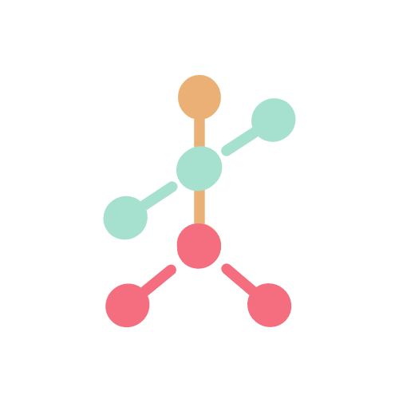

  

  
  <h1>InnoTep Research Group</h1>
  <h3>Universidad Politécnica de Madrid</h3>

  
  
  
  

## 🎯 Mission Statement
InnoTep is a multidisciplinary research group at the Universidad Politécnica de Madrid dedicated to advancing technological innovation in healthcare, privacy & security, and education. Our mission is to bridge the gap between academic research and practical applications, developing solutions that create meaningful societal impact.

## 🔬 Research Areas
Our team conducts cutting-edge research in the following domains:

### 🏥 Healthcare
- Clinical decision support systems fostering professional consensus
- eHealth platforms for hospital process optimization
- Patient-centered care technology solutions
- Development of serious games for neurodevelopmental disorder assessment
- Integration of therapeutic interventions in educational environments
- Machine learning applications for early detection and intervention

### 🔒 Privacy and Security
- Data protection in healthcare systems
- Privacy-preserving computation
- Secure information system architectures
- Cybersecurity in clinical environments
- Regulatory compliance and data governance
- Identity management and access control

### 📚 Education
- Innovation in teaching methodologies
- Technology-enhanced learning environments
- Educational assessment tools and frameworks
- Integration of therapeutic tools in educational settings
- Learning analytics and adaptive learning systems
- Digital competence development

## 🚀 Featured Projects

### Current Initiatives
- **ATENT@** - Robot asistant for ADHD assessment
- **FGCS** - Future Generation Clinical Systems
- **Gades** - Educational innovation for assesing language and communication skills
- **Galatea** - Healthcare consensus process platform

## 💡 Research Collaboration
We actively seek collaboration with:
- Academic institutions
- Healthcare organizations
- Industry partners
- PhD candidates and researchers

## 📊 Research Output
- Peer-reviewed publications
- Open-source software
- Research datasets
- Technical reports
- Conference presentations

## 🤝 Connect With Us
- 🏛️ **Official Website**: [InnoTep](https://innotep.github.io/)
- 📚 **Scientific Portal**: [UPM Science Portal](https://portalcientifico.upm.es/es/ipublic/entity/16357)
- 📧 **Email**: gi.innotep@upm.es
- 📍 **Location**: ETS. Ingeniería y Sistemas de Telecomunicación, Campus Sur, Universidad Politécnica de Madrid (UPM), Spain.

## 🛠️ Technology Stack

                                      

## 📜 Licensing
Our research output is primarily released under the **MIT License**, promoting open science and collaboration. Individual repositories may have specific licensing terms.

---

  <i>Advancing Knowledge Through Technology and Innovation</i> 
  <b>Universidad Politécnica de Madrid</b> 
  © 2024 InnoTep Research Group. All rights reserved.

